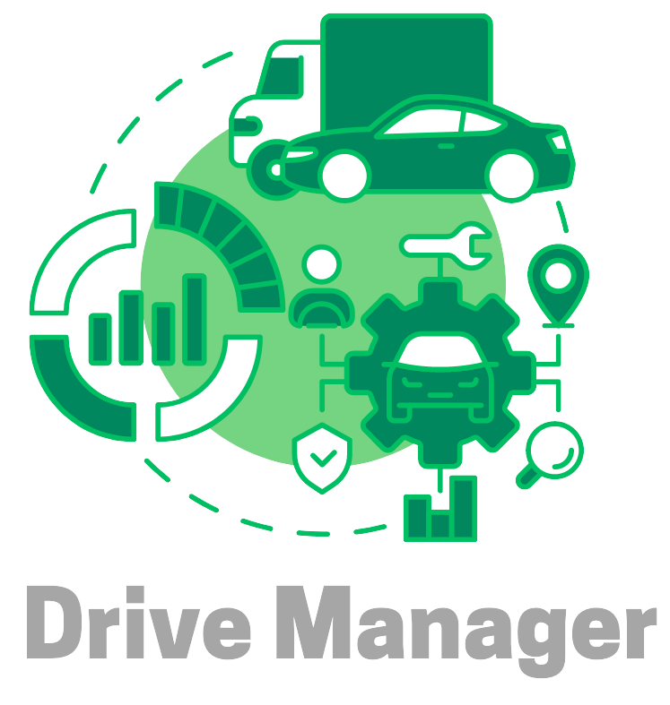

## Sobre o Aplicativo

O **Drive Manager** é uma solução abrangente para a **gestão de frotas**. Desenvolvido para facilitar o gerenciamento de veículos e motoristas, o aplicativo conta com os objetivos de permitir a administração eficiente das informações de cada veículo, monitoramento em tempo real e geração de relatórios detalhados.

## Tecnologias Utilizadas

- **Dart**: Linguagem de programação utilizada para o desenvolvimento do aplicativo.
- **Flutter**: Framework para criar a interface do usuário e lógica do aplicativo.
- **Supabase**: Plataforma de backend para autenticação e gerenciamento de dados.

## Funcionalidades

O aplicativo **Drive Manager** deverá oferece as seguintes funcionalidades:

- **Cadastro de Frota**: Adicione e gerencie veículos e motoristas, incluindo informações como status de funcionamento, chassi e IMEI do rastreador (gerado aleatoriamente no aplicativo, pois o rastreador real não está disponível).
- **Relatórios**: Gere relatórios detalhados sobre o desempenho e status dos veículos.
- **Acompanhamento em Tempo Real**: Monitore a localização dos veículos em um mapa em tempo real.
